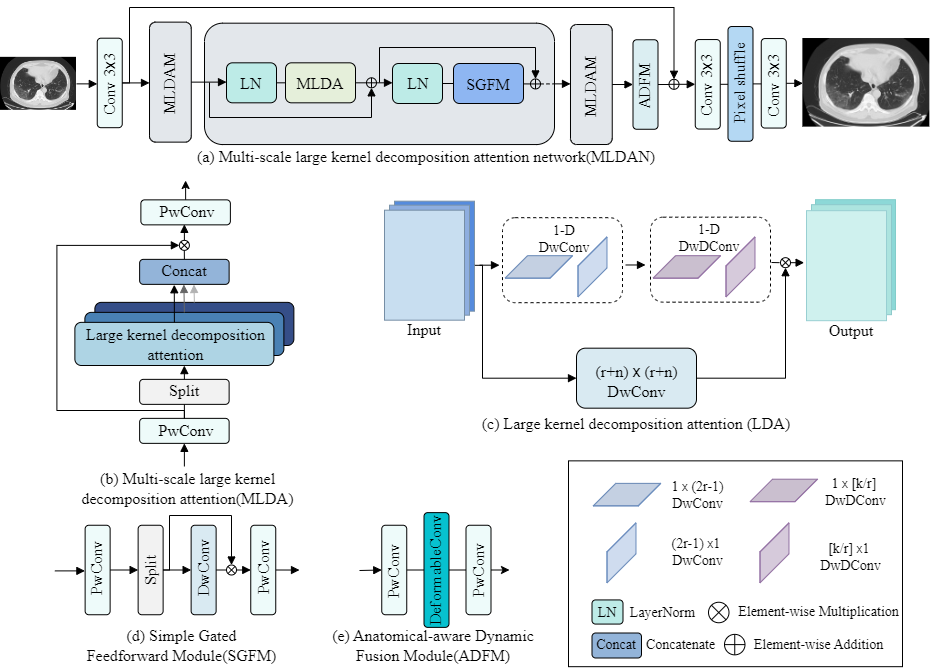
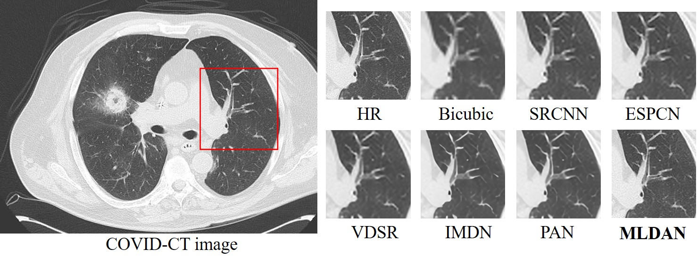
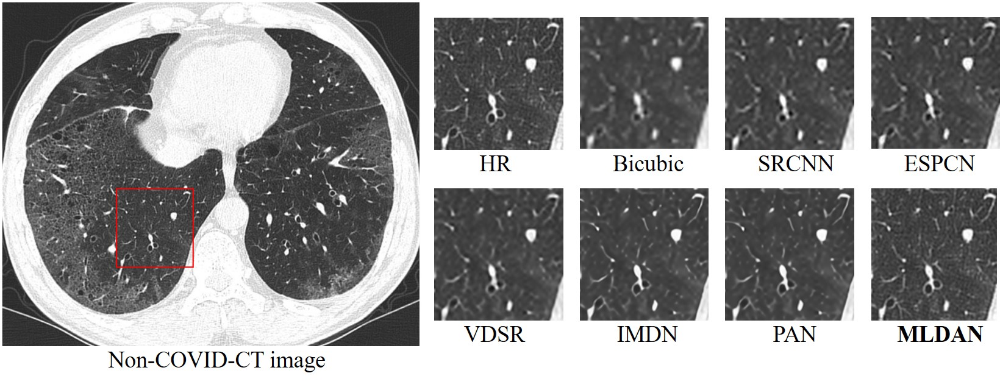
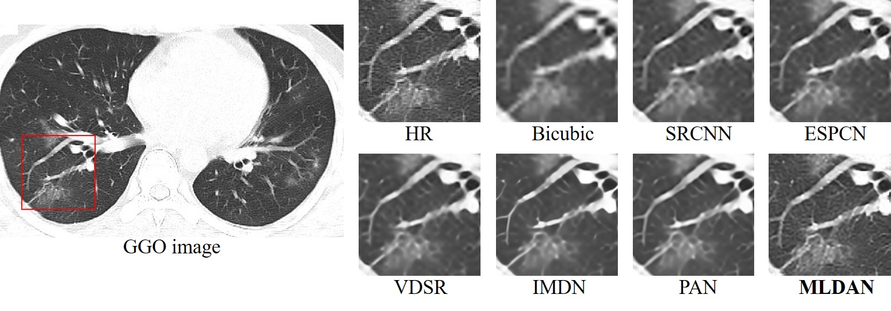
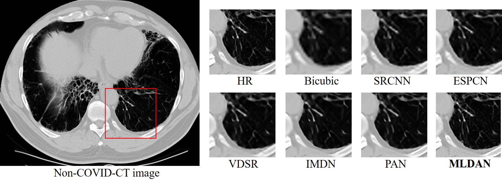
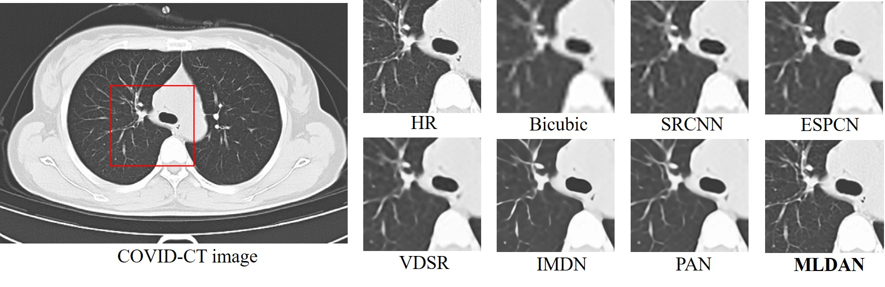
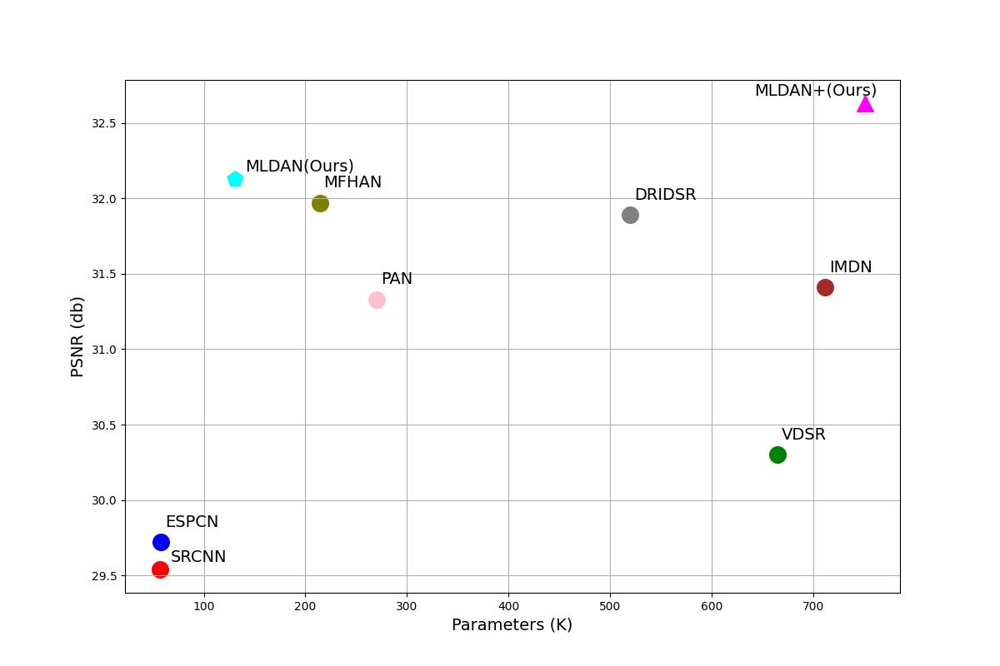

# MLDAN
### Codes for paper "[MLDAN:Multi-scale large kernel decomposition attention network for super-resolution of lung computed tomography images]".

---
## Environment
- [PyTorch >= 1.8](https://pytorch.org/)
- [BasicSR >= 1.3.5](https://github.com/xinntao/BasicSR-examples/blob/master/README.md) 


## Implementary Details
**Network architecture**: Group number (n_resgroups): **1 for simplicity**, MLDAM number (n_resblocks): **5/24**, channel width (n_feats): **48/60** for **MLDAN/MLDAN+**.
<p align="center">
     <br /></p>
    <em> The proposed method consists of three main components: the Multi-Scale Large Kernel Decomposition Attention Module(MLDAM), the Simple Gated Feedforward Module(SGFM), and the Anatomy-Aware Dynamic Fusion Module(ADFM). </em>
 &nbsp;

## Training and Testing

The [BasicSR](https://github.com/XPixelGroup/BasicSR) framework is utilized to train our MLDAN, also testing. 

**Dataset:**
 - COVID-CT: [Covid-ct-dataset](https://arxiv.org/pdf/2003.13865.pdf).

**Training with the example option:**

```
Python train.py -opt options/train_MLDANx3.yml
```
**Tesing with the example option:**

```
python test.py -opt options/test_MLDAN.yml
```

The training/testing results will be saved in the `./experiments` and `./results` folders, respectively.  

## Results
The visual comparison is shown below.
<p align="center">
    <br />
<br />
<br />
<br />
<br />
</p>


Results of our MLDAN.

| Methods | Params | Madds | PSNR/SSIM (x3) | PSNR/SSIM (x4) |
|:--------|:------:|:-----:|:---------------:|:--------------:|
| MLDAN   |  122K  | 8.2G  | 34.65/0.8983    | 32.31/0.8589   |
| MLDAN+  |  740K  | 52.5G | 34.96/0.9004    | 32.63/0.8630   |
<p align="center">
    <br />
</p>
## Acknowledgements

We would thank [LSKA](https://github.com/StevenLauHKHK/Large-Separable-Kernel-Attention) and [BasicSR](https://github.com/XPixelGroup/BasicSR) for their enlightening work!
